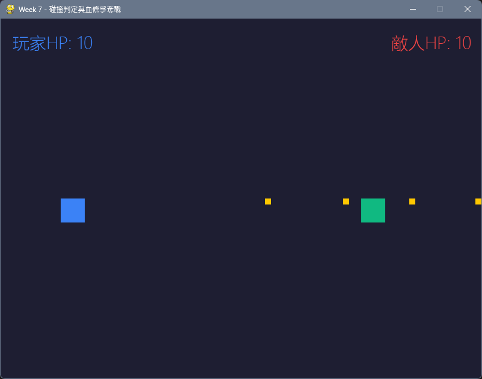
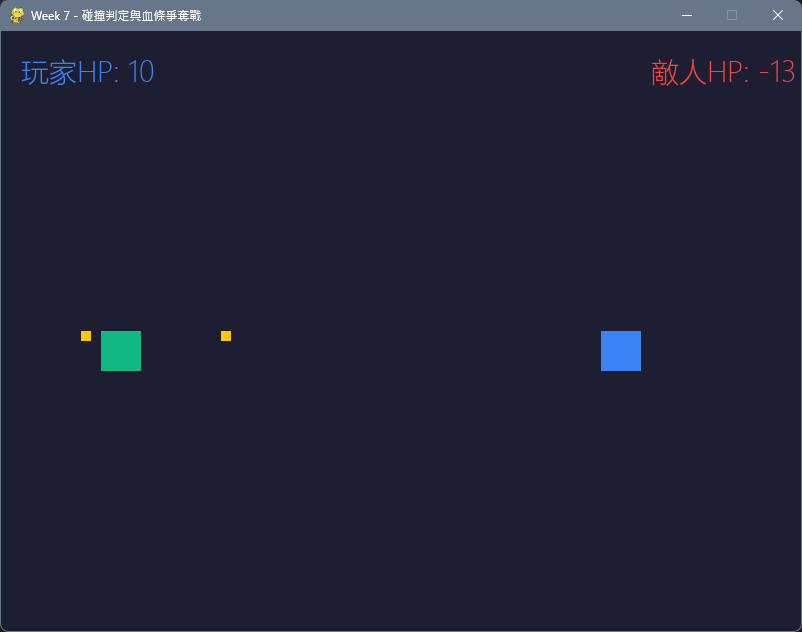

# Python Socket Connect W7

> 教學用途的雙人 P2P UDP 小遊戲，展示網路同步、碰撞判定與血量管理

## 📂 專案介紹
本專案為教學用途的雙人 P2P UDP 小遊戲示範，展示基礎網路同步、碰撞判定與血量管理。使用兩個程式（5000/5001 埠）在本機或區網模擬雙方連線，觀察角色移動、子彈發射與血量同步。

## 🖼️ 遊戲畫面
| 玩家 A（5000） | 玩家 B（5001） |
|---------------|---------------|
|  |  |

## ✨ 功能特色
| 功能 | 說明 |
|------|------|
| **P2P UDP 座標同步** | 雙向傳遞位置封包 |
| **子彈碰撞判定** | 子彈擊中敵我任一方即消失 |
| **血量管理** | 初始 10 血，被擊中扣 1 血 |
| **角色初始化** | 固定 spawn_points + player_id 避免重疊 |

## 📁 程式架構
```
w7_hitbox_template_5000.py   # 玩家 A（綁定 UDP 5000）
w7_hitbox_template_5001.py  # 玩家 B（綁定 UDP 5001）
w7_hitbox_template.py       # 單檔教學模板
```

### 核心流程
1. 初始化 Pygame 與 UDP Socket
2. 每幀接收封包（pos / shoot / hit）
3. 本地輸入控制移動與發射子彈
4. 碰撞判定與血量更新
5. 每幀送出自身座標

## ⌨️ 操作方式
| 按鍵 | 動作 |
|------|------|
| W | 向上移動 |
| S | 向下移動 |
| 空白鍵 | 發射子彈 |

## 🚀 執行方式
### 環境需求
- Python 3.10+
- pygame

### 啟動遊戲
在兩個終端機分別啟動：

```bash
# 終端機 1
uv run python w7_hitbox_template_5000.py

# 終端機 2
uv run python w7_hitbox_template_5001.py
```

若未使用 uv，可改用：

```bash
python w7_hitbox_template_5000.py
python w7_hitbox_template_5001.py
```

## ⚠️ 座標重疊問題與修正方法
### 問題
若雙方**只單純傳送自身座標**，且兩邊**沒有身分識別與出生點區分**，會造成連線後角色在畫面上**重疊**。

### 解法
目前兩支程式採用**固定出生點 + 子彈方向鏡像**的方式解決重疊問題，不需要在封包內加入 player_id。

| 策略 | 說明 |
|------|------|
| **固定出生點** | `5000.py` 固定從 `(100, 300)` 出發；`5001.py` 固定從 `(600, 300)` 出發，兩端永不重疊 |
| **省略 ID 識別** | 因為是 P2P 直連（5000 只送給 5001，反之亦然），收到的 `pos` 封包必定來自對方，直接更新 `enemy_x / enemy_y` 即可，不需要辨識 id |
| **子彈方向鏡像** | `5000.py` 發射方向為 `+10`（向右）；`5001.py` 發射方向為 `-10`（向左）；收到對方子彈封包時，方向各自反向，確保子彈往正確方向飛行 |

```python
# w7_hitbox_template_5000.py
my_x, my_y = 100, 300       # 固定出生點 A
enemy_x, enemy_y = 600, 300

# 發射子彈向右
new_bullet = {'x': my_x, 'y': my_y, 'dir': 10, 'owner': 'me'}
# 收到對方子彈，方向反向（向左）
bullets.append({'x': package['x'], 'y': package['y'], 'dir': -10, 'owner': 'enemy'})

# w7_hitbox_template_5001.py
my_x, my_y = 600, 300       # 固定出生點 B（與 5000 對調）
enemy_x, enemy_y = 100, 300

# 發射子彈向左
new_bullet = {'x': my_x, 'y': my_y, 'dir': -10, 'owner': 'me'}
# 收到對方子彈，方向反向（向右）
bullets.append({'x': package['x'], 'y': package['y'], 'dir': 10, 'owner': 'enemy'})
```

> **補充說明**：若要擴展為多人或讓雙方使用同一支程式（動態分配角色），才需要在封包加入 `player_id` 來識別身份，例如：
>
> ```python
> pos_package = {'id': player_id, 'type': 'pos', 'x': my_x, 'y': my_y}
>
> if package.get('id') == enemy_id:
>     enemy_x = package['x']
>     enemy_y = package['y']
> ```

### 修改區網 IP
若在區網測試，請將 `TARGET_IP` 改為對方電腦的內網 IP：
```python
TARGET_IP = "192.168.x.x"  # 對方的內網 IP
```
